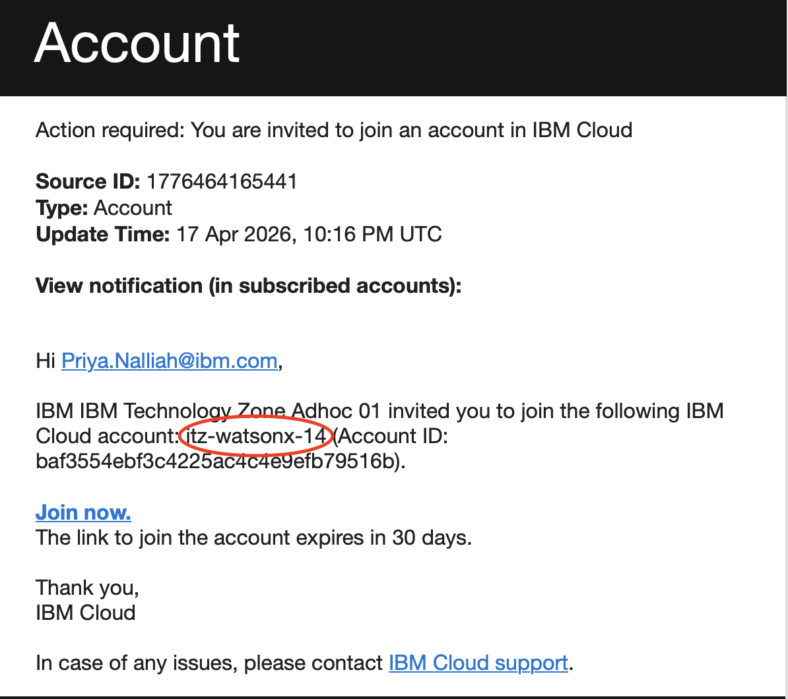
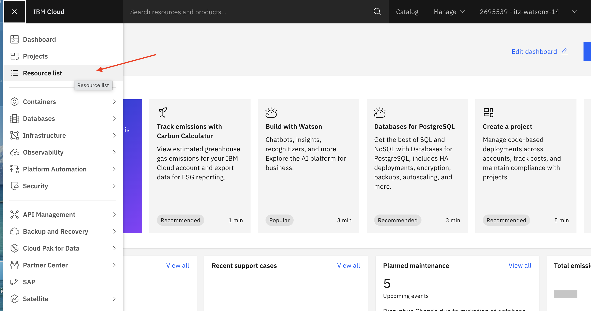
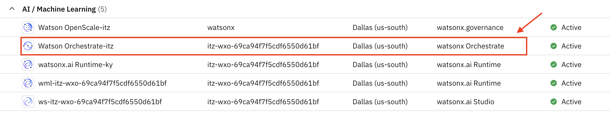
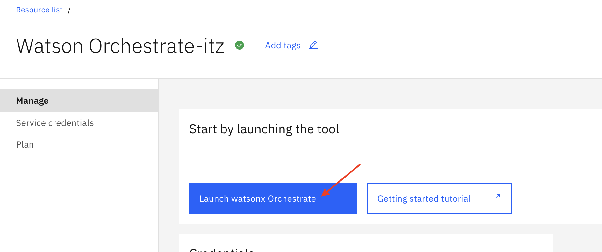
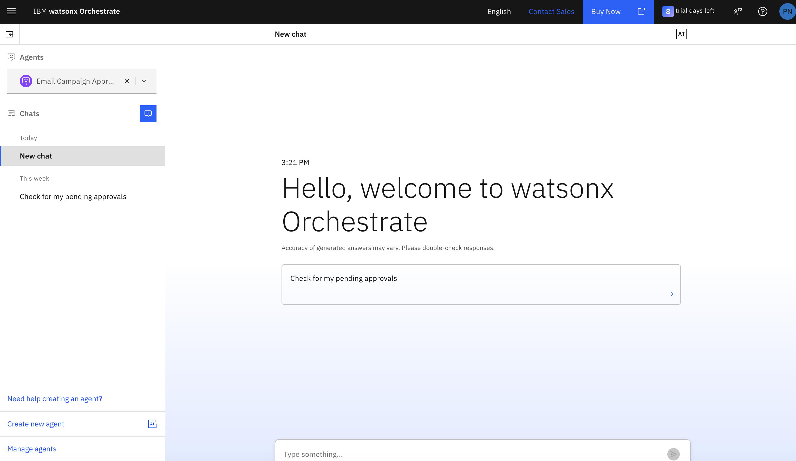

# DIRECTV Personalized Marketing Campaigns

## Lab 0: Setup and Prerequisites

## Table of Contents

- [Introduction](#introduction)
- [Pre-requisites](#pre-requisites)
- [Access Watsonx Orchestrate](#access-watsonx-orchestrate)

---

## Introduction

Welcome to the DIRECTV Agentic AI-Powered Marketing Campaign Workshop! In this prerequisite lab, you'll gain access to IBM watsonx Orchestrate to get ready for Lab 1 and Lab 2.

---

## Pre-requisites

Before starting the lab, you'll need:

1. **An IBM ID**
   - If you don't already have one, sign up for a free IBM ID at: https://www.ibm.com/account/reg/us-en/signup?formid=urx-19776
   - This is the identity you'll use to sign in to IBM Cloud and access watsonx Orchestrate.

2. **Access to Watsonx Orchestrate**
   - You will receive an invitation email to join an IBM Cloud account where watsonx Orchestrate is already provisioned and ready for you to use.
   - Accept the invitation before proceeding to the next section.

---

## Access Watsonx Orchestrate

IBM watsonx Orchestrate is IBM's platform for creating Agentic AI-powered digital workers. In this workshop, you'll use it to build marketing campaign agents.

### Launch Your Orchestrate Instance

1.  **Check Your Email**
    - You should receive an invitation to join an IBM Cloud account
    - Click the link and accept the invitation

        

    _Your account ID will look different to the one pictured above_
    - Select the **Join Now** link

2.  **Sign In to IBM Cloud**
    - Go to https://cloud.ibm.com
    - Sign in with your IBM ID credentials

3.  **Open Watsonx Orchestrate**
    - In the IBM Cloud Dashboard, click on the menu (☰) in the top-left

    - Navigate to **Resource List**
      
    - Under **AI / Machine Learning**, find **Watson Orchestrate**
      
    - Click on your Orchestrate instance to launch it
      

4.  **Verify Access**
    - You should see the Orchestrate home page
      
    - If you don't see any resources, contact your instructor

---

**Next Step:** Proceed to [Lab 1: Campaign Creation](../Lab-1-Campaign-Creation/README.md) to start building your AI marketing campaign system.
