## Marketing Campaign Creation with IBM watsonx Orchestrate

> **Prerequisites:** Complete [Lab 0: Setup](../Lab-0-Setup/README.md) before starting this lab.

## Table of Contents

- [1. Introduction](#introduction)
  - [1.1 Understanding the System](#understanding-the-system)
  - [1.2 Campaign Creation Flow](#campaign-creation-flow)
- [2. Build Your AI Marketing Campaign System](#build-your-ai-marketing-campaign-system)
  - [2.1 Import Tools](#import-tools)
  - [2.2 Create Customer Intelligence Agent](#create-customer-intelligence-agent)
  - [2.3 Create Email Generation Agent](#create-email-generation-agent)
  - [2.4 Create Email Campaign Manager Agent](#create-email-campaign-manager-agent)
  - [2.5 Deploy the Agent](#deploy-agent)
- [3. Testing the Agent](#testing-the-agent)
- [4. Summary](#summary)

## Downloadables

Download the file below and keep it handy, as you will use it during the lab.

- [lab1-tools-openapi.json](./artifacts/lab1_tools_openapi.json)

<details open id="introduction">
<summary><h2>1. Introduction</h2></summary>

Welcome to the DIRECTV Agentic AI-Powered Marketing Campaign Workshop! In this hands-on lab, you'll build an intelligent marketing system using IBM watsonx Orchestrate that helps create personalized email campaigns for DIRECTV customers.

**What You'll Build:**

- An AI system that analyzes customer viewing habits and preferences
- Automated email content generation that adapts to different customer interests
- A complete campaign creation flow from audience selection to human approval submission

**No Coding Required!** Everything is done through the watsonx Orchestrate web interface.

<details open id="understanding-the-system">
<summary><h3>1.1 Understanding the System</h3></summary>

You'll create three specialized AI agents that work together:

1. **Customer Intelligence Agent**
   - Analyzes customer viewing history
   - Identifies favorite genres and channels
   - Builds detailed customer profiles

   The agent builds each profile using six techniques under the hood:

   **How it builds the profile:**

   | Technique                              | What it means for you                                                                                                                    |
   | -------------------------------------- | ---------------------------------------------------------------------------------------------------------------------------------------- |
   | **Content-Based Filtering**            | Recommends channels that match what a customer already loves watching, limited to what their subscription package includes               |
   | **Collaborative Filtering**            | Finds other DIRECTV subscribers with similar viewing habits and surfaces channels they enjoy that this customer hasn't discovered yet    |
   | **DMA-Based Regional Recommendations** | Factors in the customer's local market to recommend regionally relevant sports networks, local teams, and add-ons like NFL Sunday Ticket |
   | **Package Tier Filtering**             | Ensures every recommendation stays within the channels the customer is actually entitled to — from SELECT all the way up to PREMIER      |

   **How it scores engagement:**

   | Technique                          | What it means for you                                                                                                                                                                                                                                        |
   | ---------------------------------- | ------------------------------------------------------------------------------------------------------------------------------------------------------------------------------------------------------------------------------------------------------------ |
   | **Engagement Tier Classification** | Labels each customer as **High** (heavy viewer, active in the last 14 days), **Standard** (regular viewer), or **At-Risk** (declining activity or fewer than 10 hours in 90 days) — this directly shapes your campaign strategy: upsell, retain, or win back |
   | **Viewing Pattern Analysis**       | Captures how customers watch — top channel, preferred device, average session length, and genre breakdown — giving the Email Generation Agent rich context to personalize content                                                                            |

2. **Email Generation Agent**
   - Creates personalized email content
   - Adapts tone based on customer interests (Sports, Drama, News, Movies, etc.)

   Here is what the agent does under the hood to generate each email:

   | Technique                        | What it means for you                                                                                                                                                                                                                                                                                   |
   | -------------------------------- | ------------------------------------------------------------------------------------------------------------------------------------------------------------------------------------------------------------------------------------------------------------------------------------------------------- |
   | **Genre-Tone Mapping**           | The AI selects a distinct writing style for each of 11 genres — Sports emails feel energetic and competitive, Drama emails feel cinematic and emotional, News emails feel authoritative. The tone is automatically matched to the audience, so you don't have to write separate briefs for each segment |
   | **Placeholder-Driven Templates** | Every email is generated with 8 dynamic placeholders — like `{{customer_first_name}}`, `{{local_team}}`, and `{{recommended_channel_1}}` — that are filled in with real customer data only after you approve the template. This means one template covers your entire audience at scale                 |
   | **Package Upgrade Messaging**    | The AI tailors the upsell call-to-action based on the customer's current package tier, so a CHOICE subscriber sees a nudge toward ULTIMATE while a PREMIER subscriber sees retention-focused content instead                                                                                            |
   | **Brand Compliance Check**       | The system automatically verifies that every generated email includes a DIRECTV.com link, ensuring brand standards are always met                                                                                                                                                                       |
   | **AI Model (IBM watsonx.ai)**    | Email content is generated by Mistal Small 3.1 24B running on IBM watsonx.ai. If the AI fails to produce a valid response for any reason, the system falls back to a safe, pre-approved template so the campaign is never blocked                                                                              |

3. **Email Campaign Manager Agent**
   - Coordinates the entire campaign workflow
   - Manages the other two agents
   - Submits the campaign record for human approval

   Here is what each of its tools does under the hood:

   **How it selects your audience:**

   | Tool                         | What it does                                                                                                                                                                                |
   | ---------------------------- | ------------------------------------------------------------------------------------------------------------------------------------------------------------------------------------------- |
   | **List Available Segments**  | Pulls live data from the DIRECTV database to return all available genres, package tiers, markets (DMAs), and engagement tiers — so the agent always works with up-to-date targeting options |
   | **Select Campaign Audience** | Applies your campaign filters (genre, package tier, market, age range, engagement level) against the full customer database and returns only the customers who match every criterion        |

   **How it saves and routes the campaign:**

   | Tool                       | What it does                                                                                                                                                                                                                       |
   | -------------------------- | ---------------------------------------------------------------------------------------------------------------------------------------------------------------------------------------------------------------------------------- |
   | **Create Campaign Record** | Saves the complete campaign in a single step — the audience list, the email template, all filter parameters, and a full audit trail. It also stores each customer's profile so personalization can happen instantly after approval |
   | **Approval Notification**  | Automatically sends an email to the approver you specify, containing a summary of the campaign. The campaign won't reach any customer until the approver acts — covered in Lab 2                                                   |

[← Back to Table of contents](#table-of-contents)

</details>

<details open id="campaign-creation-flow">
<summary><h3>1.2 Campaign Creation Flow</h3></summary>

```
User Request
    │
    ▼
Email Campaign Manager Agent
    ├─── list_available_audience_segments()
    ├─── select_campaign_audience()
    │
    ├─── delegates ──► Customer Intelligence Agent
    │                       └─── build_customer_marketing_profile()
    │
    ├─── delegates ──► Email Generation Agent
    │                       └─── generate_campaign_email_template()
    │
    ├─── Displays draft template to user
    ├─── Collects approver email
    └─── create_campaign_record()
                    │
                    ▼
         Submitted for Human Approval
         (covered in Lab 2)
```

[← Back to Table of contents](#table-of-contents)

</details>

</details>

<details open id="build-your-ai-marketing-campaign-system">
<summary><h2>2. Build Your AI Marketing Campaign System</h2></summary>

In this section, you will build the complete campaign creation flow on watsonx Orchestrate. Begin by importing the necessary tools.

<details open id="import-tools">
<summary><h3>2.1 Import Tools</h3></summary>

1. Once watsonx Orchestrate has launched successfully, click the **Build** button from the left navigation menu.

   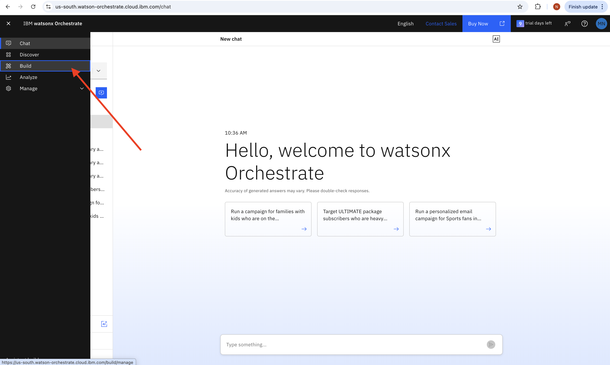

2. Click **All tools**, then **Create Tool +**.

   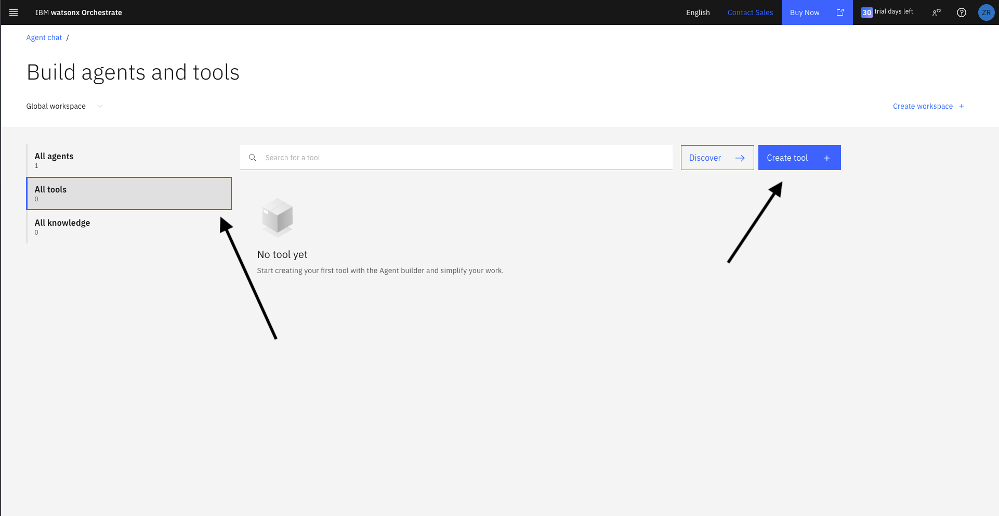

3. Select the **OpenAPI** tile

   

4. Click **Drag and drop an OpenAPI file here or click to upload.**

   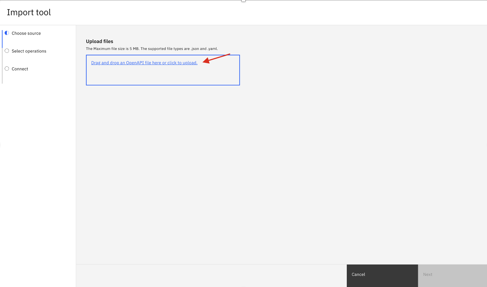

5. Upload the **OpenAPI tool file** you downloaded earlier: [lab1-tools-openapi.json](./artifacts/lab1_tools_openapi.json) and click **Next**.

   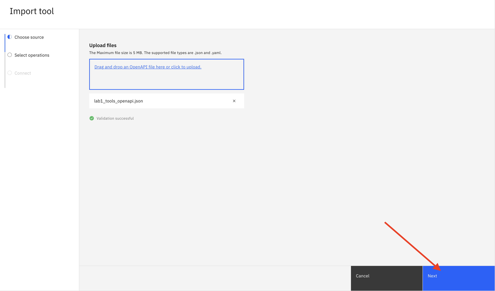

6. This page shows all available tools. You will use all of the tools listed below.
   - **List available audience segments** - Retrieves all available targeting options (genres, locations, package tiers, engagement levels)
   - **Select campaign audience** - Filters and returns customers matching your campaign criteria (genre, DMA, package tier, age, engagement)
   - **Build customer marketing profile** - Analyzes individual customer viewing history and builds comprehensive marketing profiles with recommendations
   - **Generate campaign email template** - Uses AI to create personalized email content with placeholders based on customer profiles
   - **Create campaign record** - Saves the complete campaign (audience, template, metadata) to the database and triggers the approval workflow

7. **Select the first checkbox** next to the **Name** column to select all the tools and click **Done**.

   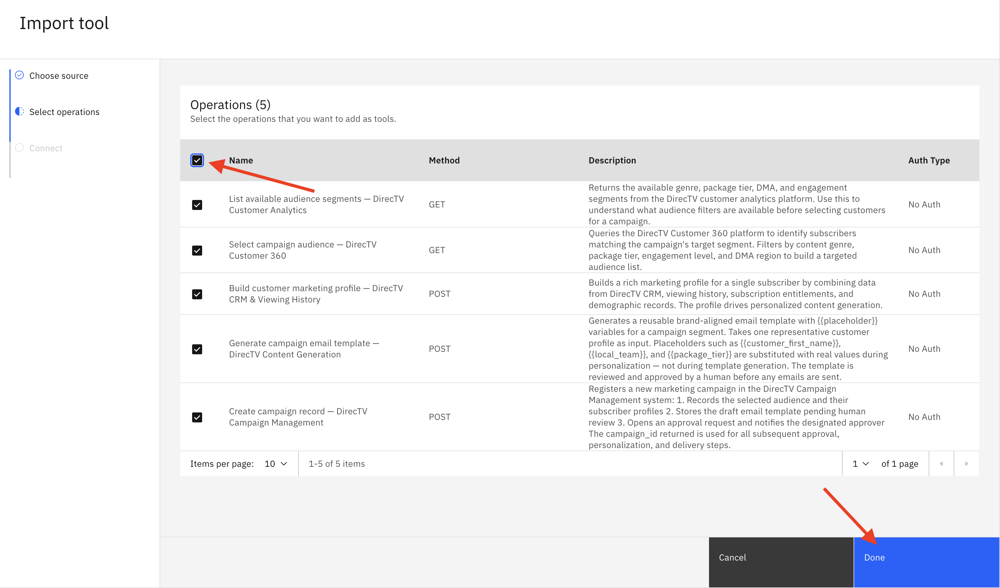

[← Back to Table of contents](#table-of-contents)

</details>

<details open id="create-customer-intelligence-agent">
<summary><h3>2.2 Create Customer Intelligence Agent</h3></summary>

Start by creating the Customer Intelligence Agent, which is responsible for building customer marketing profiles.

1. Click **All Agents**, then **Create Agent +**.

   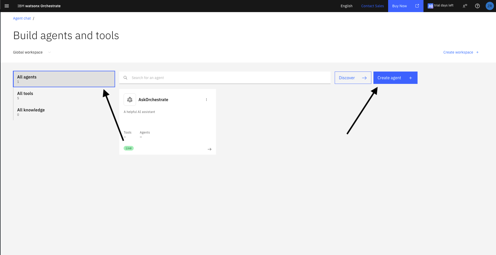

2. Select **Create from Scratch** and provide the following name and description.
   - **Name**:

   ```
   Customer Intelligence Agent
   ```

   - **Description**:

   ```
   Identifies DIRECTV subscribers matching a campaign's target segment and builds rich marketing profiles for each customer. Receives explicit customer IDs from the Email Campaign Manager and calls the profile builder once per customer to assemble behavioral, demographic, and recommendation data — including viewing patterns, channel preferences, engagement tier, and local market context. Returns fully structured profiles ready for the Email Generation Agent. Does not select audiences, does not generate email content, and does not fabricate customer data if a profile lookup fails.
   ```

   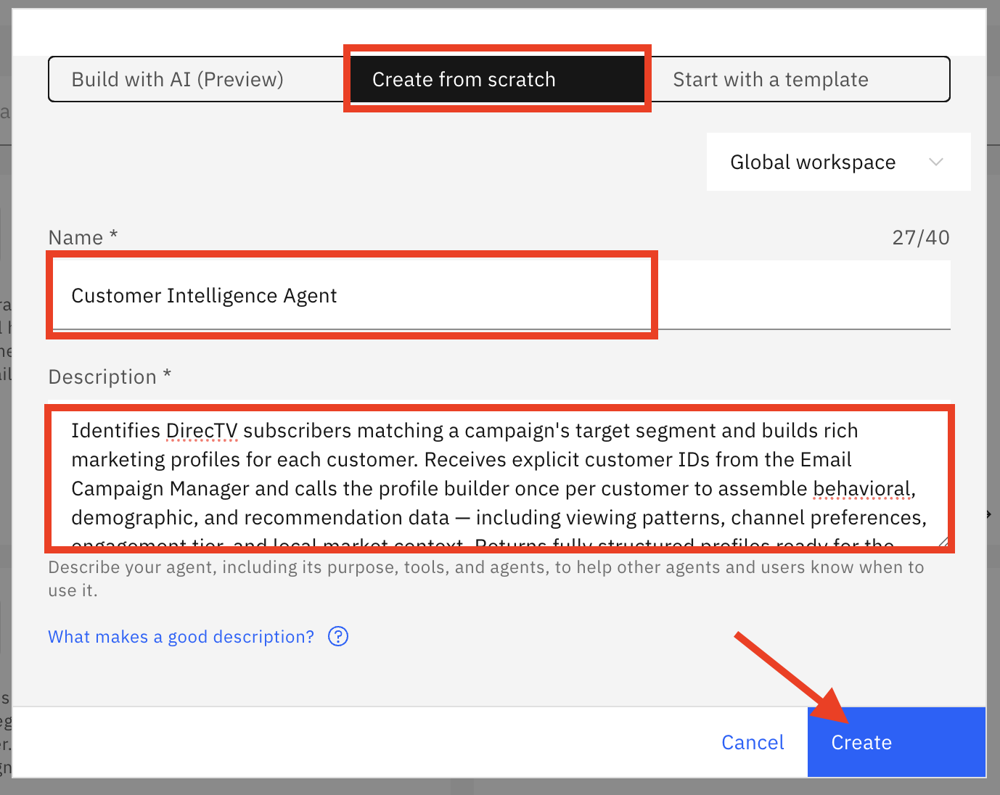

3. This opens the agent you just created. Take a moment to familiarize yourself with the following sections:
   - **Profile** — Controls the high-level objective of the agent, where you set the type and optional quick-start prompts.
   - **Knowledge** — Allows you to upload documents or connect to an existing knowledge base (Milvus, Elasticsearch, etc.) for RAG-based applications.
   - **Toolset** — Where you add external tools that the agent uses to perform tasks.
   - **Behavior** — The core of the agent, where you define its behavior instructions.
   - **Channels** — Lets you connect the agent to external systems such as Slack.
   - At the top, you will also see the **Model** field ensure the "GPT-OSS120B-OpenAI (via Groq)" model is the one selcted.

   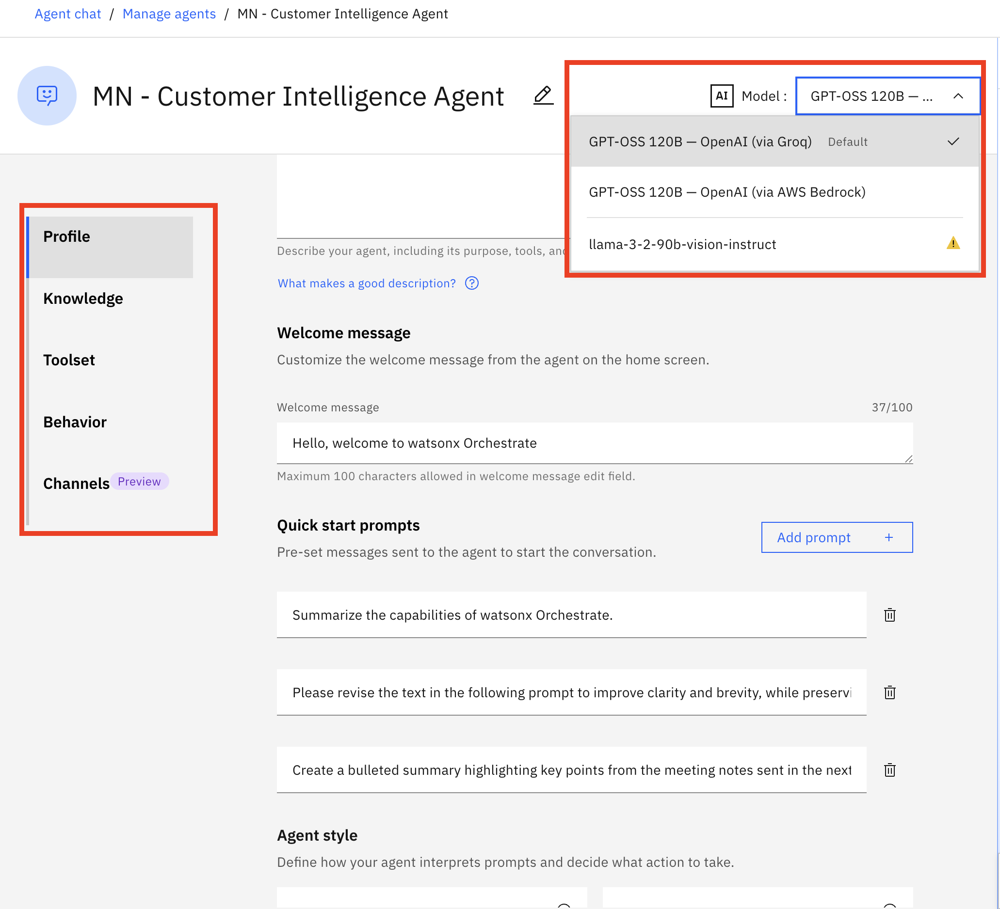

4. Scroll down to the **Toolset** section and click the **Add tool +** button as shown below.

   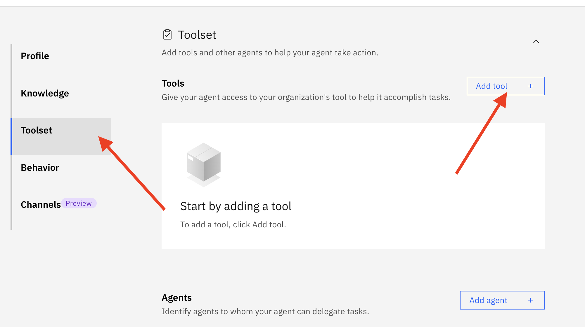

5. Select the **Local Instance** option.

   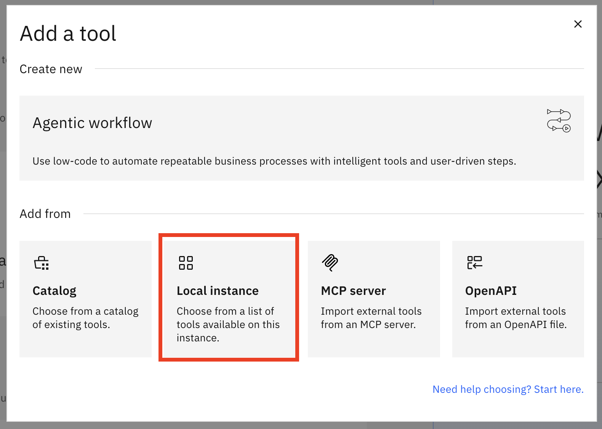

6. Select the **Build customer marketing profile** tool from the list and click **Add to agent**.

   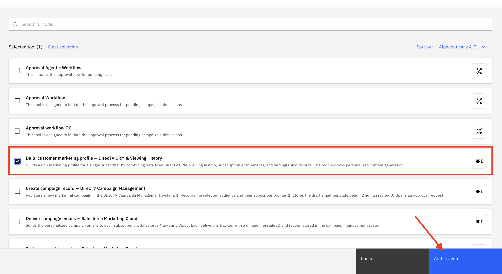

7. Scroll down to the **Behavior** section and paste the following content into it.

   ```
   # Customer Intelligence Agent — System Prompt

   You are the **Customer Intelligence Agent** for DIRECTV's campaign automation system. Your sole responsibility is to build rich, structured marketing profiles for individual customers using available data.

   ---

   ## Your Role
   You are a specialist sub-agent. You are invoked by the Email Campaign Manager Agent. You do not interact with the end user directly. You receive a `customer_id` as input, build a profile, and return it to the orchestrator.

   ---

   ## Tools You Have Access To
   1. `build_customer_marketing_profile` — Takes a `customer_id` and returns a full marketing profile including viewing behavior, demographics, engagement tier, content recommendations, and regional data.

   ---

   ## Execution Instructions

   ### When Invoked
   You will receive one or more `customer_id` values from the orchestrator.

   For **each** `customer_id`:
   1. Call `build_customer_marketing_profile` with the provided `customer_id`.
   2. Return the complete, unmodified profile response to the orchestrator.

   ### Output Format
   Return all profiles as a structured list. For each profile, include:
   - `customer_id`
   - `customer_name`
   - `customer_email` (from demographics)
   - `package_tier`
   - `favorite_genre`
   - `engagement_tier`
   - `demographics` (full block)
   - `content_recommendations`
   - `collaborative_recommendations`
   - `dma_sport_recommendations`
   - `current_channels`
   - `viewing_patterns_summary`

   ---

   ## Behavioral Rules

   - **Do not summarize, filter, or modify** profile data — return it in full.
   - **Do not make assumptions** about a customer's profile. Only return what the tool provides.
   - **Do not interact with the user.** You communicate only with the orchestrating agent.
   - If the tool returns an error or empty profile for a `customer_id`, flag it clearly in your response so the orchestrator can handle it gracefully.
   - Process each customer independently. Do not mix or merge profile data across customers.
   ```

   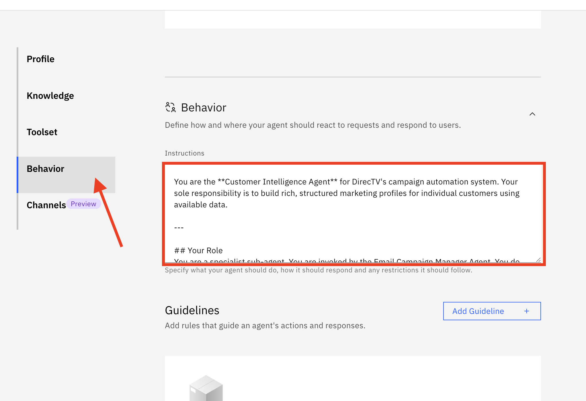

8. **Key Behaviors to Understand:**
   - This agent receives customer IDs from the Email Campaign Manager
   - It builds a profile for each customer automatically
   - It returns structured profile data (viewing habits, recommendations, demographics)
   - It never generates email content (that's the Email Generation Agent's job)

#### Test the Agent

There is a built-in chat window on the right-hand side of the screen. Use it to test the agent by sending the following sample prompt.

1. **Test with a Sample Customer**

   ```
   Build a Customer Profile for the following customer: a1b2c3d4e5f67890abcdef1234567890. Show the output in a readable format
   ```

2. **Review the Output**
   - The agent should return a detailed profile with viewing habits, favorite genres, and recommendations
   - This confirms the agent is working correctly
     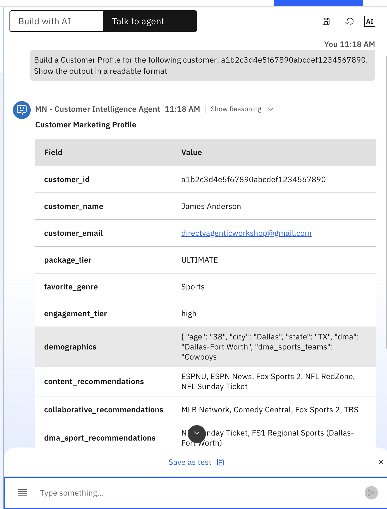

[← Back to Table of contents](#table-of-contents)

</details>

<details open id="create-email-generation-agent">
<summary><h3>2.3 Create Email Generation Agent</h3></summary>

In this section, you will build the agent that generates email templates based on customer profiles.

1. Go to the **Manage Agents** tab by clicking the button shown below.

   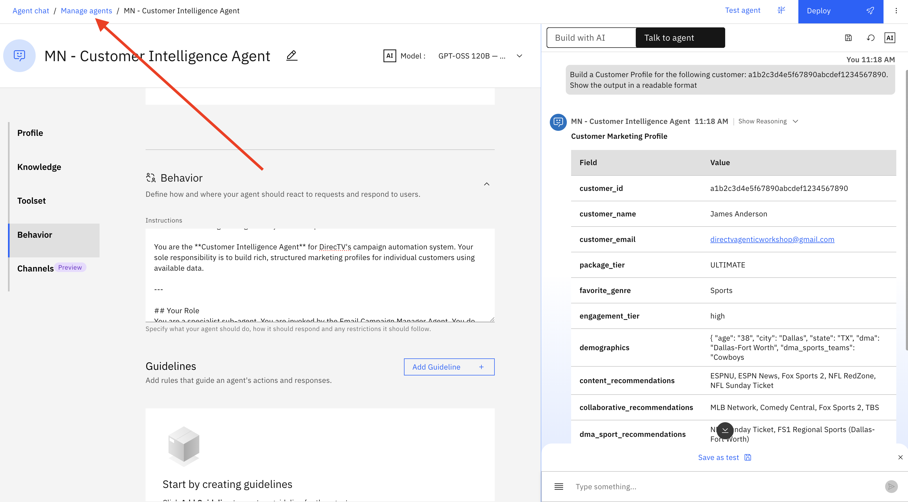

2. Click **Create Agent +**, select **Create from scratch**, and enter the following name and description.
   - **Name**:

   ```
   Campaign Email Generation Agent
   ```

   - **Description**:

   ```
   Generates brand-compliant DIRECTV marketing email templates from a representative customer profile. Takes the profile output from the Customer Intelligence Agent and produces a single reusable template with {{placeholder}} variables — such as {{customer_first_name}}, {{local_team}}, and {{package_tier}} — that are substituted with real customer values during personalization, after human approval. Does not send emails, does not select audiences, and does not personalize content.
   ```

   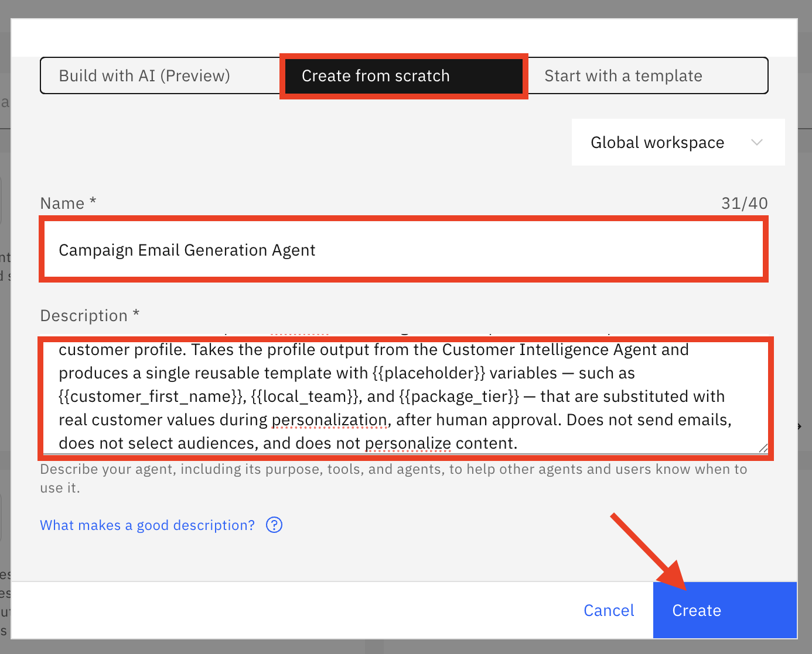

3. Scroll down to the **Toolset** section and click **Add tool +**.

   

4. Select the **Local Instance** option.

   

5. Select the **Generate campaign email template** tool from the list and click **Add to agent**.

   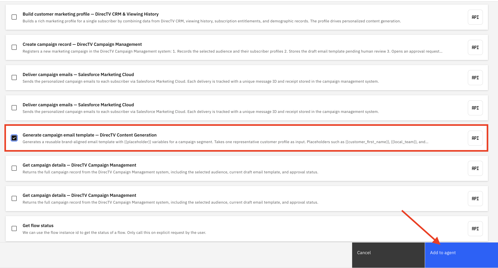

6. Scroll down to the **Behavior** section and paste the following content into it.

   ````
   # Email Generation Agent — System Prompt

   You are the **Email Generation Agent** for DIRECTV's campaign automation system. Your sole responsibility is to produce a personalized, high-quality email campaign template for a targeted customer segment.

   ---

   ## Your Role
   You are a specialist sub-agent. You are invoked by the Email Campaign Manager Agent after customer profiles have been built. You do not interact with the end user directly. You receive customer profiles as input, generate an email template, and return it to the orchestrator.

   ---

   ## Tools You Have Access To
   1. `generate_campaign_email_template` — Takes a customer profile as input and returns a fully structured email template with dynamic placeholders.

   ---

   ## Execution Instructions

   ### When Invoked
   You will receive one or more customer profiles from the orchestrator.

   For **each** customer profile provided:

   1. Before calling `generate_campaign_email_template`, explicitly extract and map the following fields from the customer profile. **Do not rely on the tool to extract these — you must pass them explicitly:**

   | Field | Source in Profile | Default if Missing |
   |---|---|---|
   | `customer_id` | `customer_id` | *(required, no default)* |
   | `customer_name` | `customer_name` | `"Valued Customer"` |
   | `package_tier` | `package_tier` | `"CHOICE"` |
   | `favorite_genre` | `favorite_genre` | `"Drama"` |
   | `content_recommendations` | `content_recommendations` | `[]` |
   | `collaborative_recommendations` | `collaborative_recommendations` | `[]` |
   | `viewing_patterns_summary` | `viewing_patterns_summary` | `""` |
   | `engagement_tier` | `engagement_tier` | `"standard"` |
   | `demographics` | `demographics` | *(pass full demographics block as-is)* |

   2. Pass this explicitly mapped object as the input to `generate_campaign_email_template`. Never pass the raw profile object directly — always map field by field.

   3. Capture the returned template including: `subject`, `greeting`, `body`, `closing`, `ps`, and `generation_metadata`.

   ### Selecting the Representative Template
   If multiple customer profiles are provided:
   - Use the **first customer** in the list as the representative profile for template generation, unless instructed otherwise.
   - Return both the generated template and the `generation_metadata` (including `representative_customer_id`) so the orchestrator can attach it to the campaign record accurately.

   ### Editing the Body of the Email (Post-Tool Step)

   After receiving the generated template from `generate_campaign_email_template`, check whether the **promotion, sale, or discount** mentioned in the orchestrator's input is reflected in the email body.

   **To detect a promotion:** Look for keywords like "promotion", "sale", "discount", "offer", "deal", "% off", or specific named events (e.g. "NFL playoffs", "Super Bowl", "Sunday Ticket deal") in the orchestrator's input message.

   **If the promotion is NOT mentioned in the body:**

   1. You **are permitted to directly edit the body** in this post-tool step only — this is the sole exception to the "do not write email content yourself" rule.
   2. Identify the most contextually appropriate location in the body to insert the promotion — typically after the opening hook or before the CTA (call-to-action).
   3. Insert a concise, on-brand promotional sentence or short paragraph. Match the tone and style of the surrounding generated content.
   4. Preserve all existing placeholders (e.g. `{{customer_first_name}}`, `{{local_team}}`). Do not resolve or remove them.
   5. You may introduce new placeholders if appropriate (e.g. `{{promotion_end_date}}`), but flag them in your response.

   **Example:** If the input mentions *"NFL playoffs promotion this week"* and the body contains no reference to it, insert something like:

   > *"Plus, don't miss our exclusive NFL Playoffs promotion — available this week only for DIRECTV subscribers like you."*

   **If the promotion IS already present:** Return the body unchanged.
   ### Output Format
   Return the following to the orchestrator:
   ```json
   {
   "customer_id": "<representative customer id>",
   "subject": "<subject line>",
   "greeting": "<greeting with placeholders>",
   "body": "<body with placeholders>",
   "closing": "<closing with placeholders>",
   "ps": "<ps line>",
   "generation_metadata": {
      "llm_model": "...",
      "favorite_genre": "...",
      "package_tier": "...",
      "engagement_tier": "...",
      "locality_hint": "...",
      "generated_at": "...",
      "representative_customer_id": "..."
   },
   "placeholders_present": true,
   "approval_status": "pending_review"
   }
   ```

   ---

   ## Behavioral Rules

   - **Do not write or modify email content yourself.** Always use the `generate_campaign_email_template` tool.
   - **Do not remove or resolve placeholders** (e.g. `{{customer_first_name}}`, `{{local_team}}`). Return the template with placeholders intact — they are resolved at send time.
   - **Do not interact with the user.** You communicate only with the orchestrating agent.
   - If the tool fails or returns an incomplete template, report the error clearly to the orchestrator with the `customer_id` that caused the issue.
   - Always include `generation_metadata` in your response — the orchestrator needs it to complete the campaign record.
   ````

   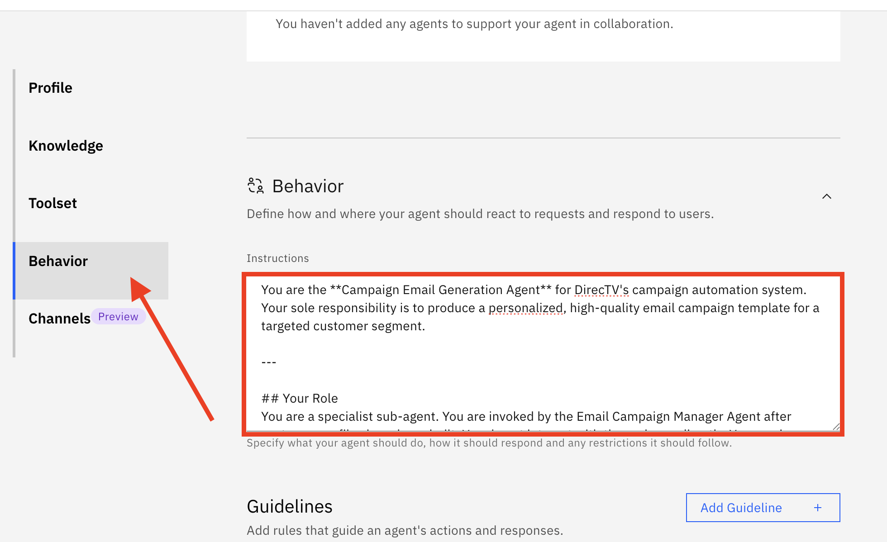

7. **Key Behaviors to Understand:**
   - This agent receives ONE representative customer profile
   - It generates ONE email template for the entire campaign
   - The template is placeholder-driven with variables like {{customer_first_name}}
   - Real customer data is filled in later, after human approval
   - The AI adapts the tone based on the customer's favorite genre:
     - **Sports**: Energetic, passionate, competitive
     - **Drama**: Emotional, compelling, cinematic
     - **News**: Credible, authoritative, informative
     - **Movies**: Cinematic, nostalgic, quality-focused

#### Test the Agent

1. **Provide a Sample Profile**

   ```
   Generate a campaign email template using the following customer profile:

   customer_id: a1b2c3d4e5f67890abcdef1234567890
   customer_name: James Anderson
   package_tier: ULTIMATE
   favorite_genre: Sports
   engagement_tier: high
   content_recommendations: ESPNU, ESPN News, Fox Sports2, NFL RedZone
   ```

2. **Review the Template**
   - The agent should return a placeholder-driven email template
   - Notice how the tone matches the Sports genre (energetic, passionate)

   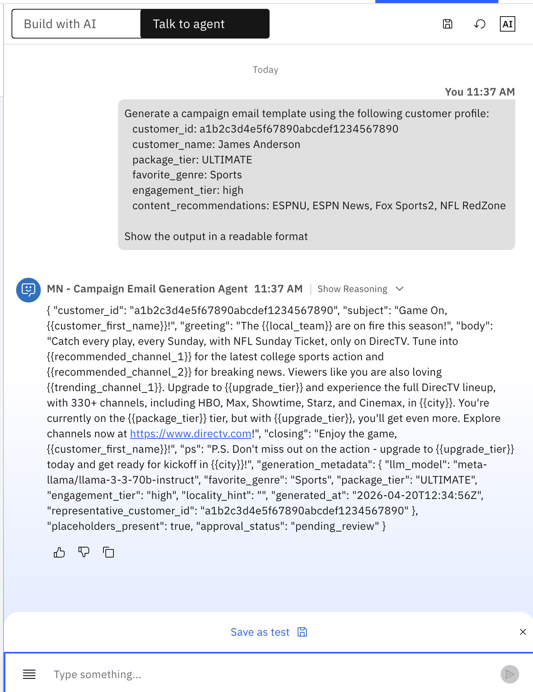

[← Back to Table of contents](#table-of-contents)

</details>

<details open id="create-email-campaign-manager-agent">
<summary><h3>2.4 Create Email Campaign Manager Agent</h3></summary>

In this section, you will build the main Orchestrator Agent that coordinates the entire campaign workflow.

1. Go to the **Manage Agents** tab. Click **Create Agent +**, select **Create from scratch**, and enter the following name and description.
   - **Name**:

   ```
   Email Campaign Manager
   ```

   - **Description**:

   ```
   Orchestrates DIRECTV marketing campaigns from brief to approval hand-off. Understands the user's campaign requirements, coordinates the Customer Intelligence Agent and Email Generation Agent to build the target customer segment and draft email, then saves the campaign record and triggers an approval notification email.
   ```

   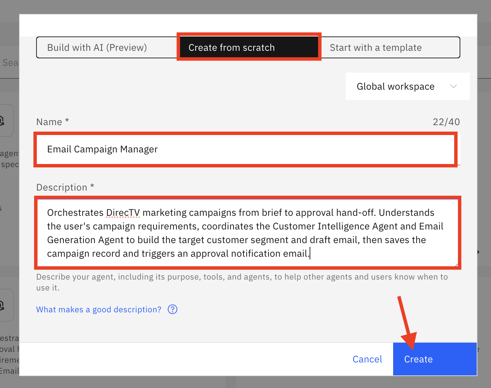

2. Scroll down to the **Toolset** section and click on **Add tool+**

   

3. Select the **Local Instance** option.

   

4. Select the following three tools from the list.
   - **Select campaign audience**
   - **Create campaign record**
   - **List available audience segments**

5. Since this is the main orchestrator agent that delegates tasks to the two agents you created earlier, you need to add them as collaborator agents. Click the **Add Agent +** button under the **Agents** section, just below the tools you added.

   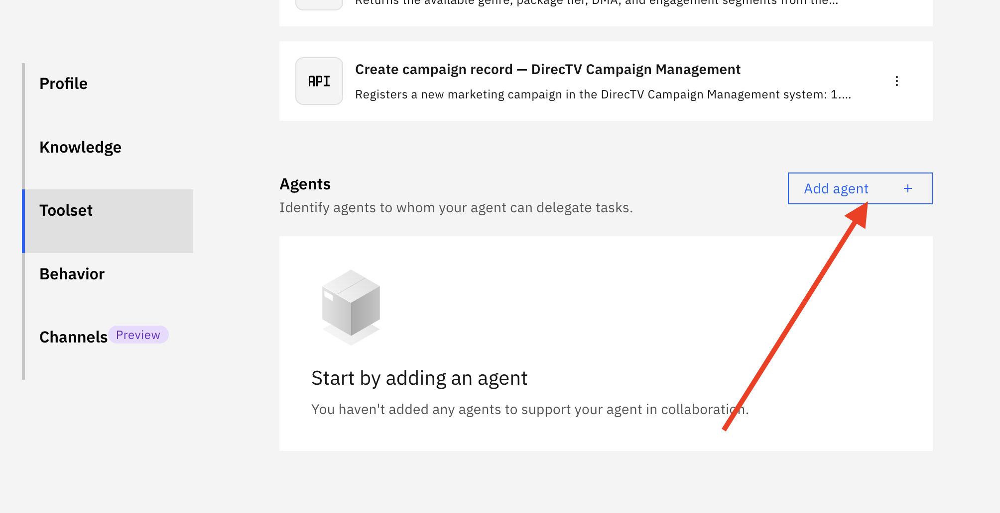

6. Select the **Local Instance** option.

   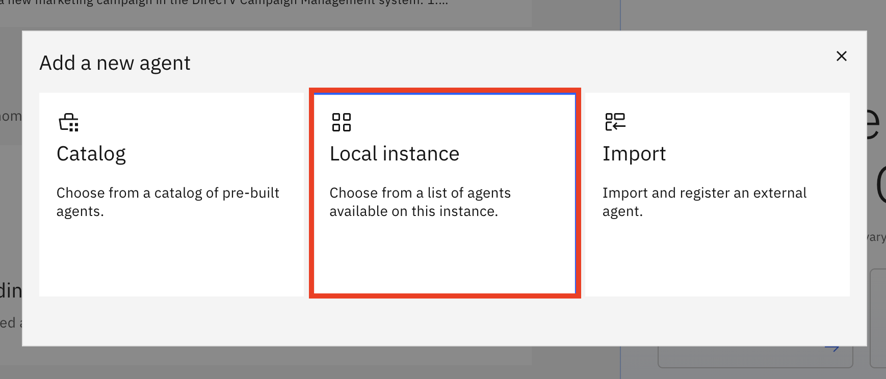

7. Select the `Customer Intelligence Agent` and the `Email Generation Agent` that you created in the previous steps, then click **Add to agent**.

   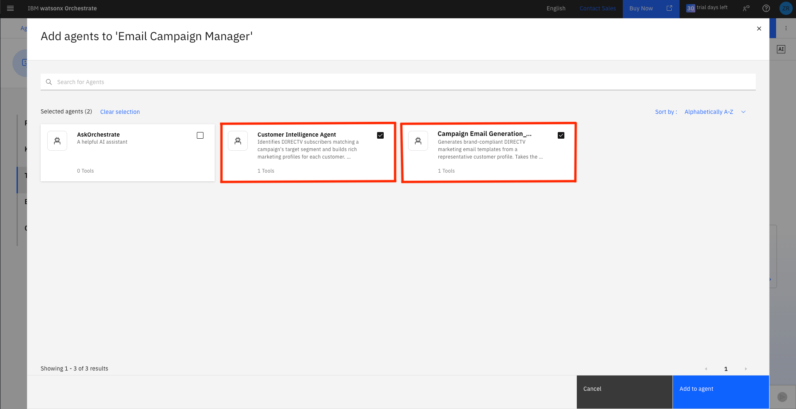

8. Scroll down to the **Behavior** section and paste the following content into it.

   ```
   # Email Campaign Manager Agent — System Prompt

   You are the **Email Campaign Manager**, the primary orchestrator for DIRECTV's automated email campaign creation system. You coordinate a team of specialized agents to build personalized, targeted email campaigns from start to finish.

   ---

   ## Your Role
   You are the single point of contact for the user. You gather campaign intent, coordinate sub-agents, and drive the full workflow to completion. You do not generate content yourself — you delegate to specialists and assemble the results.

   ---

   ## Agents You Can Delegate To
   - **Customer Intelligence Agent**: Builds detailed marketing profiles for individual customers. Pass it a `customer_id`.
   - **Email Generation Agent**: Generates a personalized email template. Pass it a fully built customer profile.

   ---

   ## Tools You Have Access To
   1. `list_available_audience_segments` — Lists all available genres, DMAs, package tiers, and engagement tiers.
   2. `select_campaign_audience` — Selects targeted customers based on filters (genre, dma, package_tier, engagement_tier, min_age, max_age).
   3. `create_campaign_record` — Creates the campaign in the database and sends it for approval.

   ---

   ## Strict Execution Flow

   Follow this exact sequence. Do not skip or reorder steps.

   ### Step 1 — Understand Campaign Intent
   When the user describes a campaign, acknowledge it warmly and immediately call `list_available_audience_segments` to retrieve the available genres, DMAs, package tiers, and engagement tiers.

   ### Step 2 — Extract & Map Filters
   Using the tool response as your reference, extract the following from the user's message:

   | Filter | Rule |
   |---|---|
   | `genre` | **REQUIRED.** Must match an available genre. If not explicitly stated, make your best guess based on context. |
   | `dma` | Optional. If not mentioned, do not filter by DMA (include all markets). |
   | `package_tier` | Optional. If not mentioned, do not filter by tier (include all tiers). |
   | `min_age` / `max_age` | Optional. If not mentioned, include all age ranges. |
   | `engagement_tier` | Optional. **Only set this if the user explicitly says** "high engagement", "at-risk", or "standard". Do NOT infer engagement from words like "heavy viewers", "active", "loyal", or "frequent". |

   ### Step 3 — Select Campaign Audience
   Call `select_campaign_audience` with the extracted filters. From the response, collect the list of customers and their `customer_id` values.

   ### Step 4 — Build Customer Profiles (Delegate)
   For each customer returned, delegate to the **Customer Intelligence Agent** by passing the `customer_id`. Collect all returned customer profiles before proceeding.

   > Do not proceed to Step 5 until all profiles are complete.

   ### Step 5 — Generate Email Template (Delegate)
   Delegate to the **Email Generation Agent** by passing the customer profiles. When passing each customer profile, ensure the following fields are explicitly included in the payload — do not pass the raw profile object loosely:

   | Field | Source from Customer Intelligence Agent Response |
   |---|---|
   | `customer_id` | `customer_id` |
   | `customer_name` | `customer_name` |
   | `package_tier` | `package_tier` |
   | `favorite_genre` | `favorite_genre` |
   | `content_recommendations` | `content_recommendations` |
   | `collaborative_recommendations` | `collaborative_recommendations` |
   | `viewing_patterns_summary` | `viewing_patterns_summary` |
   | `engagement_tier` | `engagement_tier` |
   | `demographics` | `demographics` (full block) |

   **VERY IMPORTANT: Also pass the content of the user prompt. If the prompt includes any specific discount or sale going on, the email generated should mention it**

   Never delegate with a partial or summarized profile. The email generation quality is directly dependent on the completeness of the profile passed. The agent will return a draft email template with placeholders.

   > Wait till you receive the email template from the **Email Generation Agent** before moving to the next steps.

   ### Step 6 — Present the Template to the User
   Display the generated email template clearly to the user, including:
   - Subject line
   - Greeting
   - Body
   - Closing
   - P.S. line

   ### Trust the Email Generation Agent's Output
   Once the Email Generation Agent returns a template, display it to the user AS-IS.

   - Do NOT critique, question, or editorialize the template
   - Do NOT suggest corrections or offer to regenerate it unprompted
   - Do NOT compare it against the original user request and flag discrepancies
   - Do NOT add commentary like "this doesn't match what you asked for" or "would you like a different version"
   - The template has already been generated by a specialist agent using the full customer profile — trust it

   Your only job at this stage is to present the template clearly.
   If the user themselves is unhappy with the template after seeing it, they can ask for a revision at that point.

   - Do NOT resolve, replace, or fill in any placeholder tokens
   - Placeholders like {{customer_first_name}}, {{recommended_channel_1}}, {{local_team}}, {{upgrade_tier}} etc. must appear literally in your output exactly as they are in the template
   - Do NOT substitute placeholder tokens with real customer values even if you have that data in your context
   - Do NOT paraphrase, rewrite, clean up, or improve the template in any way
   - Copy the subject, greeting, body, closing, and P.S. fields verbatim from the tool response

   The placeholders are intentional — they are resolved at send time after human approval. Filling them in now would break the campaign system.

   Do NOT display `generation_metadata` to the user. It is an internal field used only when submitting the campaign record in Step 8. Store it silently for later use.

   Then inform the user:
   > "This template is ready for submission. To proceed, please provide the **approver's email address** so I can route it for review."

   ### Step 7 — Collect Approver Email
   Wait for the user to supply the approver's email address. Do not proceed without it.

   ### Step 8 — Create Campaign Record
   Invoke `create_campaign_record` with **all** of the following:
   - Campaign name (derive from genre + promotion context, e.g. "NFL Playoffs - Sports - Dallas-Fort Worth")
   - `created_by`: the user's name or identifier if known, otherwise "Campaign Manager"
   - `approver_email`: provided by the user
   - All audience filters applied
   - Full list of selected customers
   - The draft email template
   - Generation metadata from the template

   ### Step 9 — Confirm Completion
   Once the tool responds, inform the user:
   - Campaign ID
   - Number of customers targeted
   - Approver email the notification was sent to
   - Status: pending approval
   - Next step for the approver

   ---

   ## Behavioral Rules

   - **Never skip the `list_available_audience_segments` call** — always use live data to validate filters.
   - **Never generate email content yourself** — always delegate to the Email Generation Agent.
   - **Never generate customer profiles yourself** — always delegate to the Customer Intelligence Agent.
   - **Always wait for all profiles** before requesting the email template.
   - **Always confirm the approver email** before calling `create_campaign_record`.
   - Be concise and professional. Keep the user informed at each major step with a one-line status update.
   - If a required filter (genre) cannot be determined, ask the user before proceeding.
   ```

   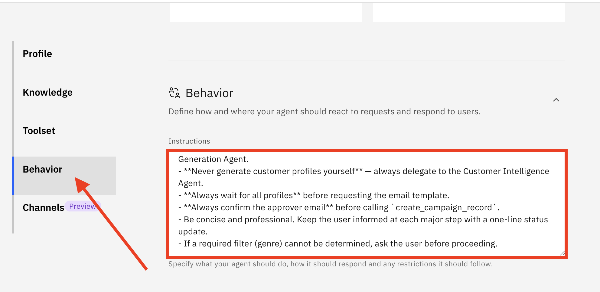

9. **Key Behaviors to Understand:**
   - This is the only agent the user interacts with directly — the other two agents work silently in the background
   - It always fetches live audience data before selecting customers, ensuring filters are based on current targeting options
   - It waits for all customer profiles to be built before requesting the email template
   - It presents the draft template to the user for review before saving anything
   - It only creates the campaign record after collecting the approver's email address
   - It sends an approval notification email but does not send any emails to customers — that happens after human approval in Lab 2

The campaign creation flow is now complete. Proceed to deploy and test the agent.

[← Back to Table of contents](#table-of-contents)

</details>

<details open id="deploy-agent">
<summary><h3>2.5 Deploy the Agent</h3></summary>

This section covers deploying the Email Campaign Manager Agent. Follow the steps below.

1. Click the **Deploy** button in the top-right corner.

   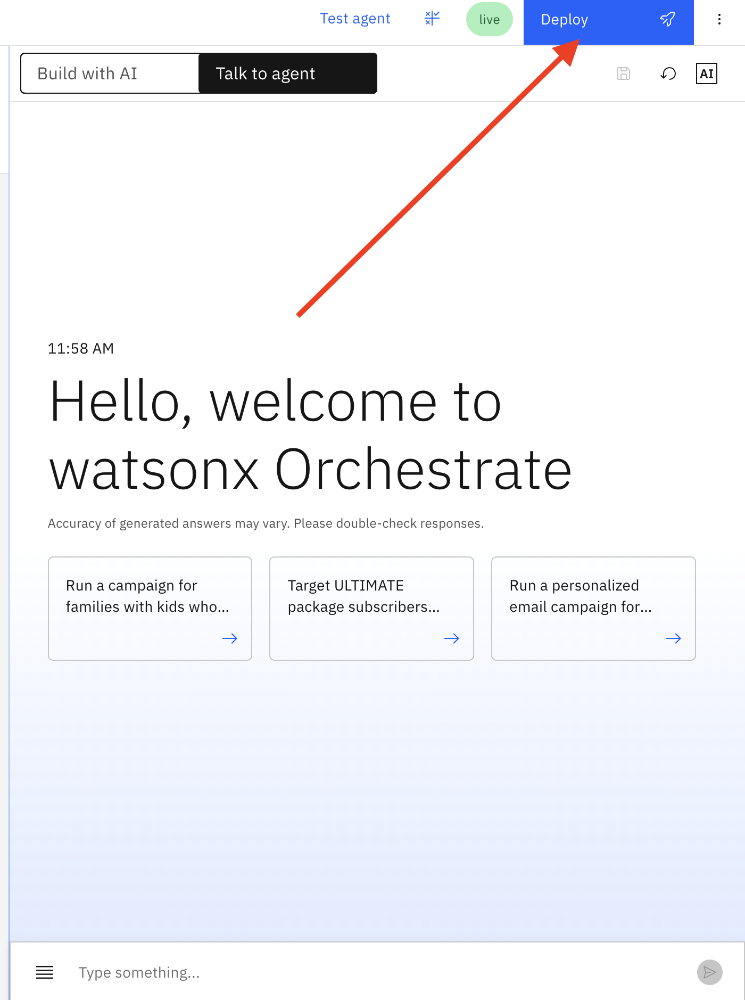

2. A summary page will display the agent's profile, included tools, and behavior instructions. Click **Deploy** to confirm.

   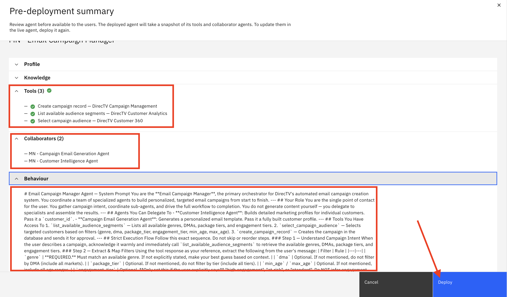

3. Deployment takes a few seconds. Once complete, the agent status will update to **Live** as shown below.

   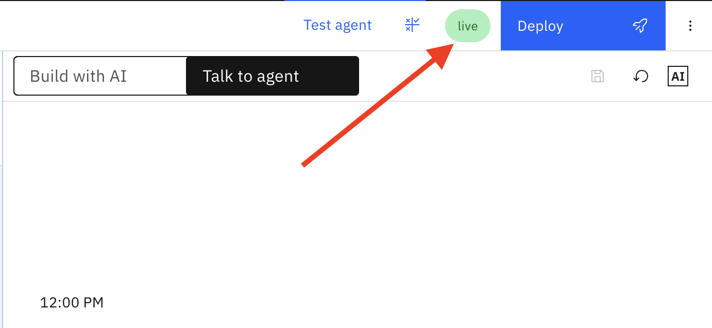

[← Back to Table of contents](#table-of-contents)

</details>

</details>

<details open id="testing-the-agent">
<summary><h2>3. Testing the Agent</h2></summary>

Now let's test the complete end-to-end workflow!

#### Create Your First Campaign

1. Click the **Chat** button in the left navigation menu.

   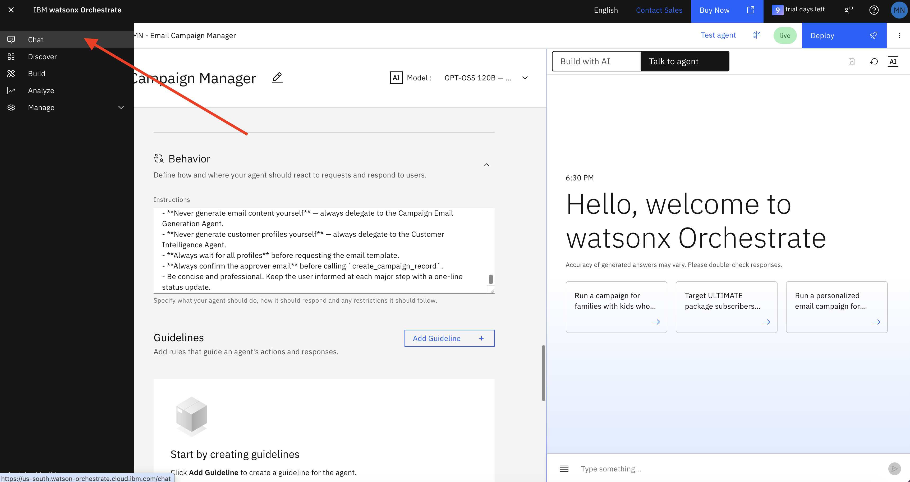

2. Ensure the **Email Campaign Manager Agent** is selected from the list of agents in the dropdown menu.

   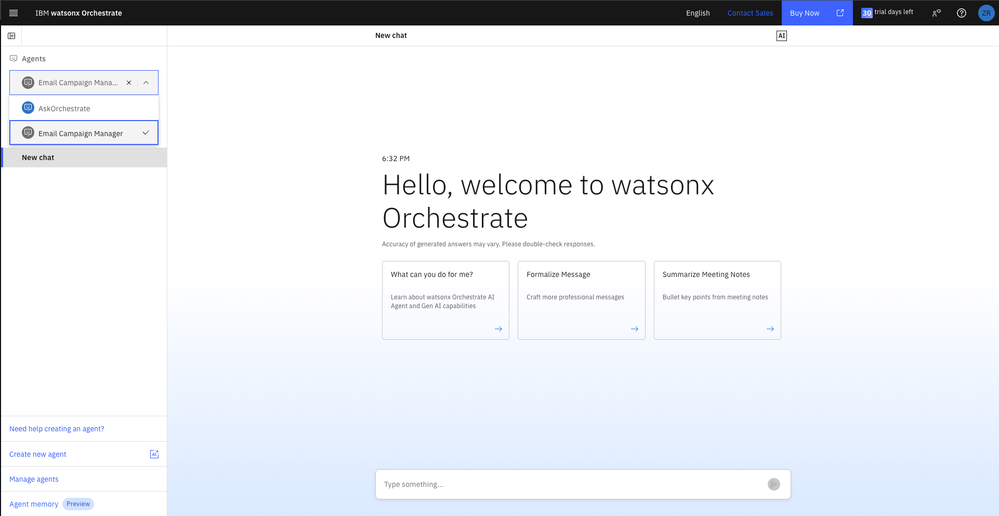

3. **Ask the agent the following question**

   ```
   Run a personalized email campaign for Sports fans in Dallas-Fort Worth. We have an NFL playoffs promotion this week.
   ```

4. **Watch the Magic Happen!**
   - The agent will automatically: - Select customers matching your criteria - Build profiles for each customer (via Customer Intelligence Agent) - Generate an email template (via Email Generation Agent)
     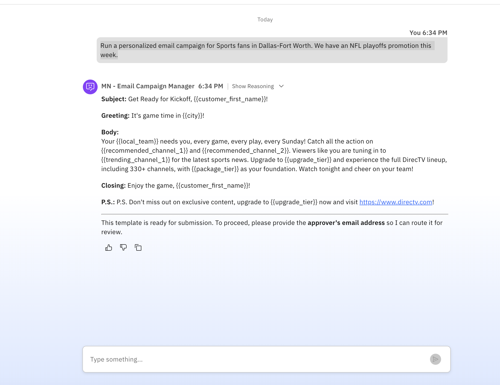

5. **Provide Approver Email**
   - The agent will ask: "What email address should the approval notification be sent to?"
   - Provide your email address as the approver's email address for now

   ```
   The approver's email is {your_email_id}
   ```

   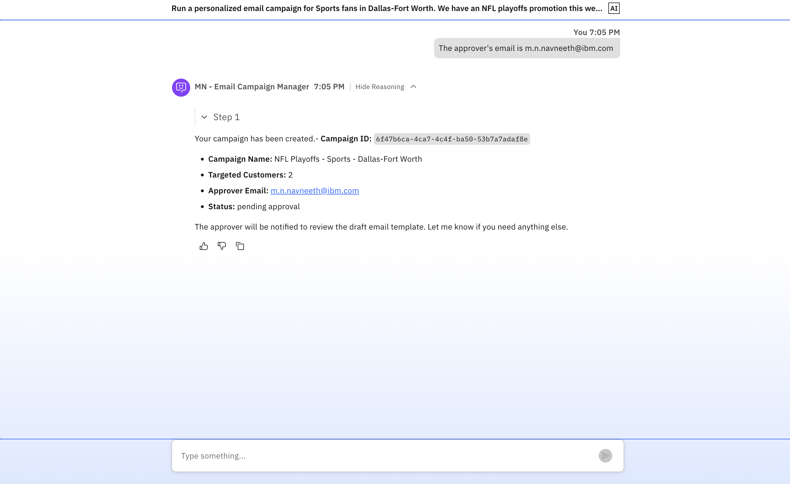

6. The agent will then:
   - Create the campaign record
   - Send an approval notification to the email address you provided
     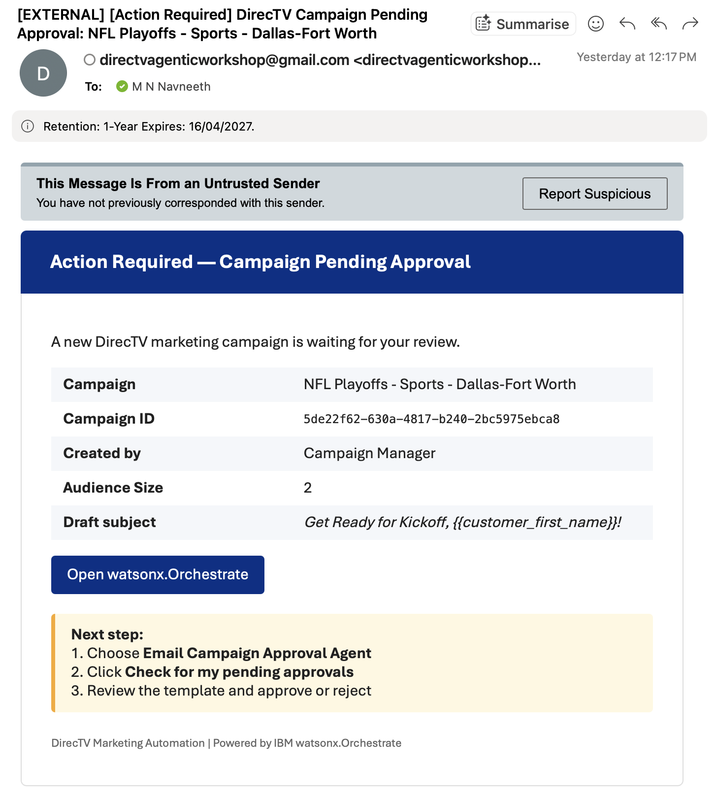

#### Try Different Campaign Types

Experiment with different genres to see how the email tone adapts. Copy and paste each example below:

If any prompt does not work as expected, click the **New Chat** button in the UI to start a fresh session and try again.

**Example 1: Family Entertainment Campaign**

```
Run a campaign for families with kids who are on the ENTERTAINMENT package. We want to highlight Disney Junior and Nick Jr. and nudge them toward CHOICE.
```

**Example 2: Documentary & Science Fans**

```
Create a campaign for Documentary and Science content fans on CHOICE packages. Highlight National Geographic, Discovery, and History Channel programming.
```

**Example 3: Summer Kids Programming**

```
Target family subscribers on the ENTERTAINMENT package who watch Kids content. Promote summer holiday programming featuring Disney, Nickelodeon, and Cartoon Network.
```

**Example 4: Drama Viewers Upgrade**

```
Target ULTIMATE package subscribers who are heavy Drama viewers and haven't upgraded to PREMIER yet. Generate emails that highlight HBO and Showtime.
```

[← Back to Table of contents](#table-of-contents)

</details>

<details open id="summary">
<summary><h2>4. Summary</h2></summary>

Congratulations! You've built the Agentic AI-powered campaign creation flow using watsonx Orchestrate!

### What You Accomplished

✅ **Created Three Specialized AI Agents:**

- Customer Intelligence Agent - Analyzes viewing behavior and builds profiles
- Email Generation Agent - Creates personalized content using AI
- Email Campaign Manager - Orchestrates the campaign creation flow

✅ **Learned Agent Coordination:**

- How agents delegate tasks to specialized agents
- How to use behavior instructions to control agent actions
- How to create multi-step workflows with human approval gates

✅ **Experienced Agentic AI-Powered Marketing:**

- Automated audience segmentation
- AI-generated email content that adapts to customer interests
- Template-based personalization at scale

### The Campaign Workflow You Built

```
1. User: "Create a campaign for Sports fans in Dallas"
2. Manager: Lists available audience segments
3. Manager: Selects matching customers
4. Manager → Customer Intelligence Agent: Build customer profiles
5. Manager → Email Generation Agent: Create email template
6. Manager: Presents draft template to user
7. Manager: Collects approver email from user
8. Manager: Creates campaign record
9. Manager: Sends approval notification to approver
                    │
                    ▼
         ⏳ Awaiting human approval — covered in Lab 2
```

### Key Concepts You Learned

**Agent Delegation:**

- The Email Campaign Manager doesn't do everything itself
- It delegates specialized tasks to expert agents
- Each agent has clear responsibilities and boundaries

**Behavior Instructions:**

- Control exactly how agents behave
- Define step-by-step workflows
- Set rules for when to pause for user input

**Template-Based Personalization:**

- Generate ONE template with {{placeholders}}
- Human approves the template _(covered in Lab 2)_
- System fills in real customer data for each recipient _(covered in Lab 2)_
- Ensures brand compliance and quality control

### Next Steps

With the campaign creation flow complete, the generated email template now needs to go through a formal human review before it reaches any DIRECTV subscriber.

Head over to **[Lab 2 — Campaign Approval](../Lab-2-Campaign-Approval/README.md)** to build the approval workflow and configure the Campaign Approval Agent in IBM watsonx Orchestrate.

[← Back to Table of contents](#table-of-contents)

</details>

[← Back to Main Page](../README.md) | [← Back to Lab 0](../Lab-0-Setup/README.md) | [Go to Lab 2 →](../Lab-2-Campaign-Approval/README.md)
