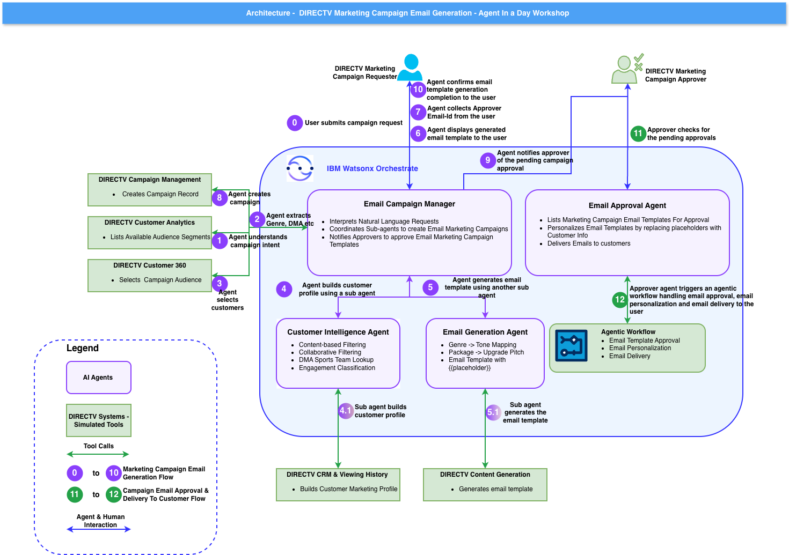

# DIRECTV Agentic AI-Powered Marketing Campaign Workshop
### IBM watsonx Orchestrate — Agent in a Day

---

## Welcome

This hands-on workshop walks you through building an **Agentic AI-powered marketing email campaign system** for DIRECTV using **IBM watsonx Orchestrate**.

You will design and configure a multi-agent system that takes a plain-language campaign request from a marketing team member all the way through to a human-approved, personalized email campaign — with no coding required. Everything is done through the watsonx Orchestrate web interface.

---

## What You Will Build

**Lab 0** sets up your access to IBM watsonx Orchestrate.

**Lab 1** builds the campaign creation flow:
- Accept a natural-language campaign brief (e.g. *"Run a Sports campaign for Dallas-Fort Worth fans"*)
- Automatically identify and select the right audience from DIRECTV's customer database
- Build rich individual customer profiles using viewership and demographic data
- Generate a placeholder-driven email template tailored to the audience's genre, engagement level, and location — ready for human review
- Submit the campaign and notify the approver

**Lab 2** implements the approval workflow:
- Review pending campaigns and inspect the generated email template
- Approve or reject the campaign with feedback
- Upon approval, the system replaces the `{{placeholders}}` with each customer's real data and delivers the campaign

---

## System Architecture



---

## Agents Overview

| Agent | Role | Built In |
|---|---|---|
| **Email Campaign Manager** | Orchestrator — drives the full campaign creation flow and coordinates all other agents | Lab 1 |
| **Customer Intelligence Agent** | Builds detailed marketing profiles per customer using viewership and demographic data | Lab 1 |
| **Email Generation Agent** | Produces a `{{placeholder}}`-driven email template for human review — placeholders are filled in only after approval | Lab 1 |
| **Email Campaign Approval Agent** | Handles the human-in-the-loop approval workflow | Lab 2 |

---

## End-to-End Flow

```
Marketing user: "Run a Sports campaign for Dallas-Fort Worth fans"
        │
        ▼
Email Campaign Manager Agent
        ├── Lists available audience segments
        ├── Selects matching customers
        │
        ├── delegates ──► Customer Intelligence Agent
        │                     └── Builds rich profile per customer
        │
        ├── delegates ──► Email Generation Agent
        │                     └── Generates {{placeholder}}-driven
        │                         email template for review
        │
        ├── Presents draft template to user
        ├── Collects approver email
        └── Creates campaign record and notifies approver
                        │
                        ▼
            ⏳ Awaiting human approval — Lab 2
                        │
                   [Approved]
                        │
                        ▼
            {{Placeholders}} replaced with real customer data
            and campaign delivered to each customer
```

---

## 📂 Lab Structure

```
📦 LAB_Material/
├── 📁 Lab-0-Setup/
│   └── README.md          ← Environment setup and prerequisites
├── 📁 Lab-1-Campaign-Creation/
│   └── README.md          ← Build the campaign creation agents
├── 📁 Lab-2-Campaign-Approval/
│   └── README.md          ← Build the approval workflow agent
└── Readme.md              ← You are here
```

---

## 🚀 Labs

Work through the labs **in order** — each lab builds on the previous one.

| Step | Lab | What You Will Do |
|---|---|---|
| 1 | [Lab 0 — Setup](./Lab-0-Setup/README.md) | Accept your invitation email, sign in to IBM Cloud, and launch watsonx Orchestrate |
| 2 | [Lab 1 — Campaign Creation](./Lab-1-Campaign-Creation/README.md) | Build the three campaign creation agents and run your first end-to-end campaign |
| 3 | [Lab 2 — Campaign Approval](./Lab-2-Campaign-Approval/README.md) | Build the approval agent and complete the human-in-the-loop review workflow |

---

## Key Concepts You Will Learn

- **Multi-agent orchestration** — how a parent agent delegates tasks to specialist sub-agents
- **Human-in-the-loop approval** — campaigns are reviewed and approved before any email reaches a customer
- **Placeholder-based personalization** — one template is generated and approved, then each customer's real data is substituted at send time
- **Behavior instructions** — how plain-English instructions control exactly what each agent does and does not do
- **No-code agent building** — everything is configured through the watsonx Orchestrate web interface

---

## Ready to Begin?

Start with the environment setup before anything else.

**[Go to Lab 0 — Setup](./Lab-0-Setup/README.md)**

---

*Workshop developed for DIRECTV by IBM Client Engineering.*
